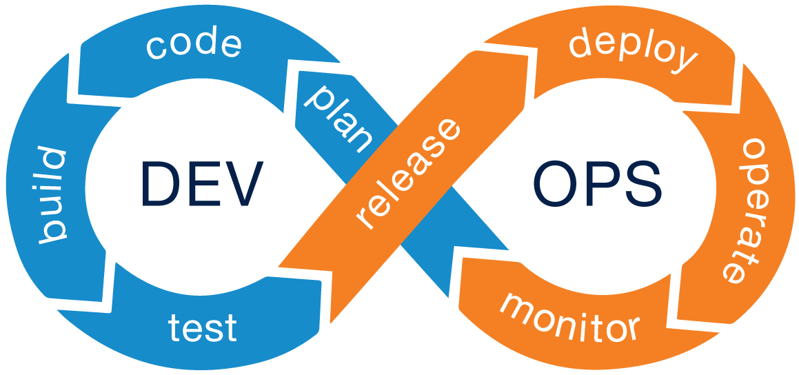

DevOps adalah singkatan dari Development and Operation Menurut saya adalah penjembatan antara Development team dan Operation Team untuk mengurangi waktu antara perubahan pada sistem dan perubahan ditempatkan ke produksi normal sambil memastikan kualitas hasil produksi.

DevOps sangat penting untuk perusahaan sebagai penyeimbang antara development dan operations. Tidak menggunakan Devops proses yang dilakukan Development dan operasi secara terpisah akan memerlukan banyak waktu dan dari hal tersebut biaya diperlukan akan meningkat. Tujuan devops tersebut untuk mengurangi waktu dan menjaga kualitas produksi dibagian operasi dan pengembangan suatu produk dibagian development.

DevOps Flow :

