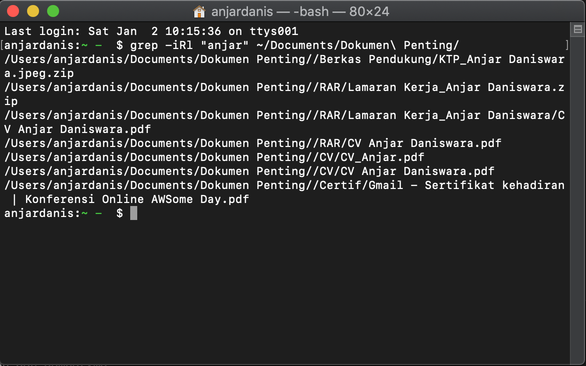

Jika Ingin Mencari File di dalam computer kita pada terminal  dan hanya mengetahui isi file menggunakan command

## __Command__

    grep -iRl "[text]" [file folder]

    + i   : pencarian tidak akan peka (case sensitive) terhadap huruf besar atau kecil. . Artinya, jika Anda mencari kata dengan huruf kecil, misalnya “mobil”, maka kata dengan huruf besar “MOBIL” juga akan ikut ditampilkan.
    + R   : mencari file ke subdirektori juga
    + l   : akan menampilkan output file yang menyimpan kata

## __contoh__ :

    grep -iRl "anjar" ~/Documents/Dokumen\ Penting/

Hasil :

