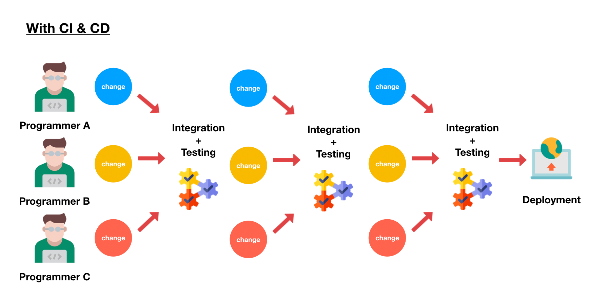

CI/CD (Continuous Integration/Continuous Development) sangat diperlukan karena memiliki kelebihan dibanding cara tradisional:

1. lebih efisien dalam testing
2. mengurangi pekerjaan manual
3. menghemat waktu
4. mempercepat time to market

